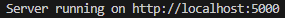

# JavaScript Server and REACT app

## Running these on your machine

First: change directory to `./JavaScriptApp` and run:

```bash
npm i
npm start
```

Once you see  you know that it's running.

Then, create a new terminal (you need 2 running at the same time) and change directory to `./JavaScriptApp/my-app` and run:

```bash
npm i
npm start
```

Everything should run smoothly
